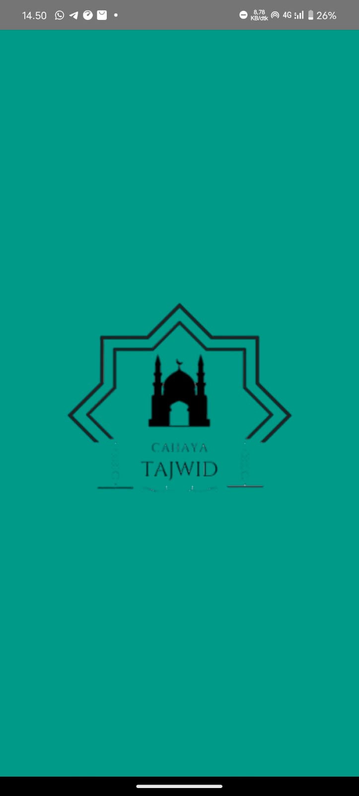
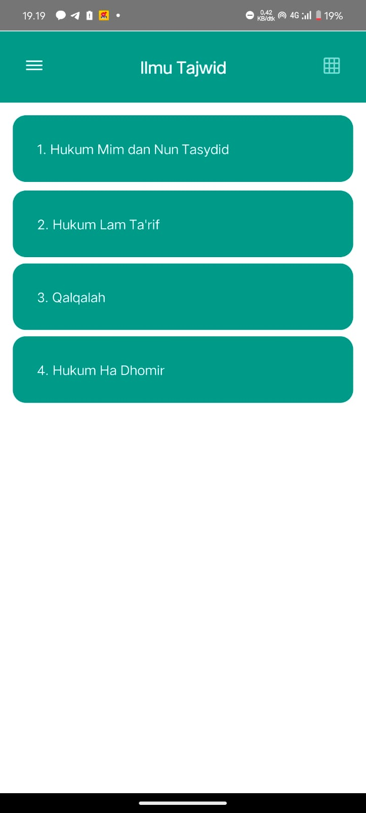
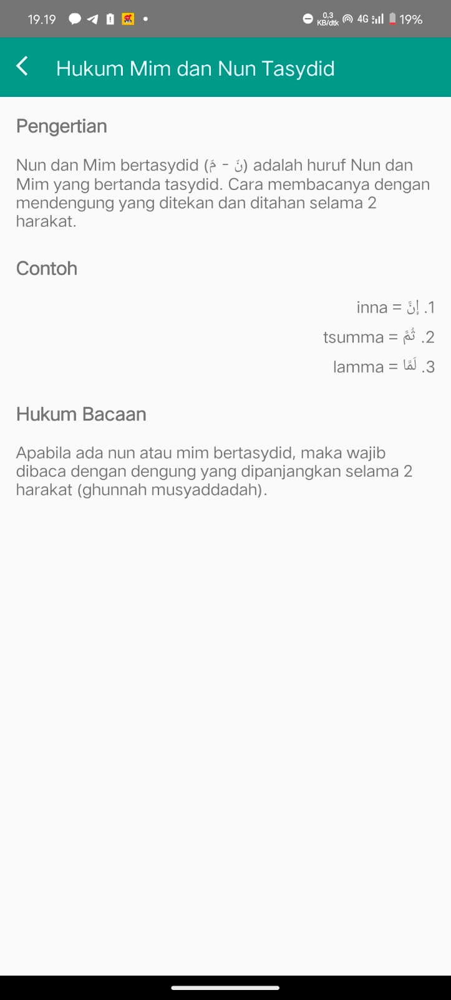
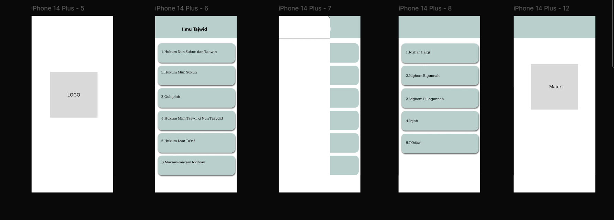
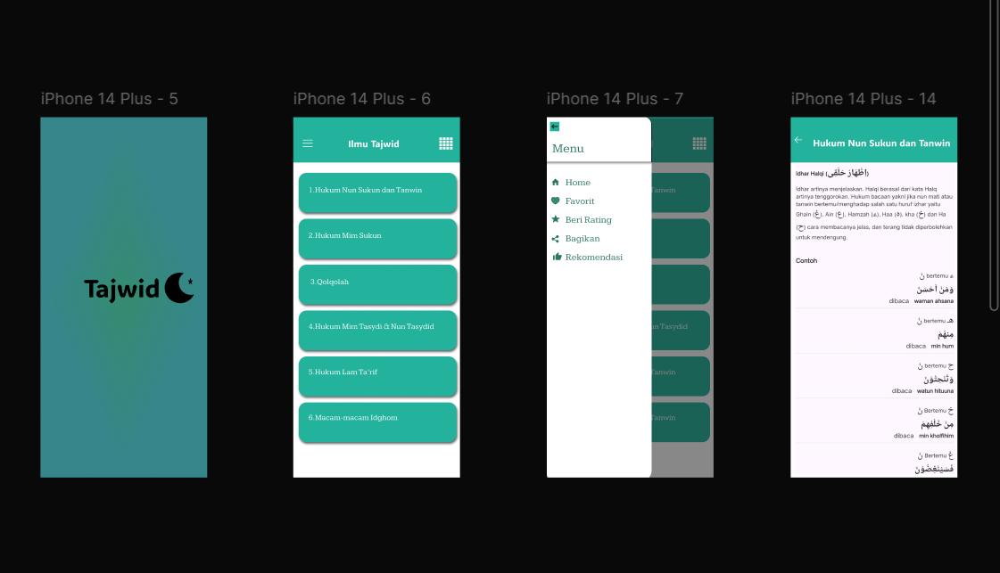

# Profile
| **Variable**       | **Isi**                            |
|---------------------|------------------------------------|
| *Nama*             | Ariq ibtihal firdaus             |
| *Kelas*            | TI.23.A.5                         |
| *Mata Kuliah*      | Pemrograman Web 1                 |
| *Dosen Pengampu*   | Donny Maulana, S.Kom., M.M.S.I.   |
## Project Tajwid

Aplikasi Tajwid adalah sebuah perangkat lunak atau platform digital yang dirancang untuk membantu pengguna dalam mempelajari, memahami, dan menerapkan ilmu tajwid. Tajwid adalah ilmu yang mengatur cara membaca Al-Qur'an dengan benar sesuai dengan makhraj (tempat keluarnya huruf) dan sifat huruf, sehingga bacaan menjadi sesuai dengan aturan yang telah ditetapkan.
* ### Splash Screen

(akan segera di update secara berkala)
* ### Home

(akan segera di update secara berkala)
* ### Materi

(akan segera di update secara berkala)

## Storyboard

## Mockup

## UI & UX

